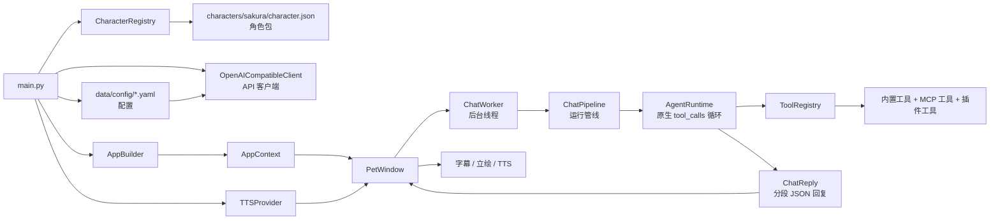

[English](README.en.md)

# Sakura Desktop Pet

最近推完水晶社的新作，~~推完自动变成学姐的狗~~，已经变成学姐的形状了，夜里辗转反侧怎么都睡不着，所以起来开发了这个桌宠Agent框架

这个框架有一大特色就是 **她会主动找你**。传统聊天机器人只有在你先开口时才会回应，就像一扇需要你敲门才会开的锁。Sakura 更接近一个坐在你旁边的人——你不需要一直和她说话，但她知道你在做什么，偶尔觉得该说点什么的时候会自己开口。

比如你正在打游戏，她瞥见屏幕上的死亡提示，凑过来说「已经第三回了…要不要帮你查下攻略？」同意后就真的打开浏览器搜了一圈，把要点贴进备忘录。

或者是你在浏览其他角色的图片时，会吃醋地说「又在看别人了啊…」要求你多看看她的立绘，偶尔还会因为你太久没看她而生气地说「都不理我了啊…」

所以这个框架实现的是一个一直在角落、会观察、会偶尔插话的角色。她的对话风格、表情、语音都由角色卡驱动，而工具能力（浏览器操作、屏幕截图、文件读取、Web 搜索、提醒、长期记忆等）则来自内置的 Agent 引擎。

把它想成一个定制角色的桌面 Agent。


## 🚀 新手教程（零基础也能用）

**不需要会编程。** 推荐直接使用 **Release 里的 `0.9.3` 版本**，不要只下载 GitHub 页面上的源码压缩包。源码包缺少预置 `runtime`，新手会更容易卡在 Python 和依赖安装上喵~

> **平台提醒：** Windows 版本是当前主要测试目标。macOS 包会在 Release 中构建出来，但 **Mac 目前没有经过实际机器测试**，可能遇到权限、启动脚本或依赖问题；如果你用 Mac，请把它当作实验版本。

### 第一步：下载发布包

打开 [Releases 页面](https://github.com/Rvosy/sakura/releases)，务必下载 `0.9.3` 及之后的版本, 之前的版本有重大BUG

Release 里常见的文件含义如下：

| 文件名 | 是什么 | 适合谁下载 |
|:-:|---|---|
| `sakura-v0.9.3-windows-x64.zip` | Windows 完整包，包含项目文件和 `runtime` | **Windows 新手首选** |
| `runtime-windows-x64.zip` | 只有 Windows 预置 Python 运行环境 | 拉源码、缺 `runtime` 的用户 |

> 如果你只是想运行桌宠，下载 `sakura-v0.9.3-windows-x64.zip` 这种 **完整包**。`runtime` 包不是完整程序，单独下载后不能直接启动。

### 第二步：安装依赖

解压完整包后，进入解压出来的项目目录。`runtime` 文件夹自带了 Python，但依赖包还是要装一次：

- **Windows 用户：** 双击 `install.bat`，等待完成（约 5-15 分钟）。
- **Mac 用户：** 可尝试双击 `install.command`，或在终端进入项目目录后运行 `bash scripts/install.sh`。但 Mac 没有实机测试过，遇到问题请优先反馈日志。
- **Linux 用户：** 当前没有正式发布包；如果从源码运行，进入项目目录后运行 `bash scripts/install.sh`。

> 如果是直接拉取的源码，需要先从 Release 页面下载对应平台的预编译依赖包（`sakura-runtime-*.zip`），把里面的 `runtime` 文件夹放到项目根目录，再运行安装脚本。
> 不管下载的是 Release 完整包还是 GitHub 源码，这一步都要做。装完命令行窗口会自动关闭。

### 第三步：获取 API Key

桌宠需要一个「AI 大脑」才能说话，你需要一个 API Key。就像给手机插 SIM 卡才能上网一样。

1. **获取 API Key。** 可以从以下任一渠道获得：
   - 国内中转站如 [GemAI](https://api.gemai.cc/register?aff=rwbQ) (有便宜且按次计费的 gemini-flash 系列模型)
   - 其他任何兼容 OpenAI 接口格式的服务

> **🚫 目前不要使用 DeepSeek 系列模型！**
>
> Sakura 的很多功能（屏幕观察、图像识别等）直接依赖模型的多模态能力（视觉理解），而 DeepSeek 系列模型不具备多模态能力，使用后会导致桌宠无法正常观察屏幕、识别图像等功能失效。
>
> 请选择支持视觉/多模态的模型，例如 Gemini Flash 等。

### 第四步：一键启动

- **Windows 用户：** 双击项目根目录的 **`start.bat`**
- **Mac 用户：** 可尝试双击 `start.command`，或在终端里运行 `bash scripts/start.sh`。再次提醒：Mac 没有实机测试过。
- **Linux 用户：** 在终端里运行 `bash scripts/start.sh`
- **右键** 桌宠或托盘图标可以打开菜单（设置、聊天记录等）


### 第五步：获取角色包

#### 获取渠道

暂时只有百度网盘

- **[百度网盘](https://pan.baidu.com/s/5ZXvAi6n6i7-OJAYeWDpprg)**：包含所有已发布的角色包.

#### 安装方式

1. 下载角色包
2. 设置页选择导入

### 如何更新版本?

如果你已经装过旧版，推荐按下面方式更新：

1. 关闭正在运行的 Sakura。
2. 下载同平台的最新**完整包**，例如 Windows 用户下载 `sakura-v0.9.3-windows-x64.zip`。
3. 解压新包，把新包里的文件复制到旧 Sakura 目录，遇到同名文件选择 **覆盖/替换**。
4. 如果启动失败, 再运行一次安装脚本：Windows 双击 `install.bat`；Mac/Linux 运行 `bash scripts/install.sh`。
5. 启动 Sakura：Windows 双击 `start.bat`；Mac 可尝试 `start.command` 或 `bash scripts/start.sh`。


以下内容面向想深入了解架构或做开发的用户。如果你是纯用来玩的，到这里就够啦~

---


## 设计思路

Sakura 现在采用更直接的运行时结构：UI 负责收集用户输入、截图、确认面板和主动事件，`ChatWorker` / `ChatPipeline` 负责把这些上下文整理成一次运行请求，真正的对话决策和工具循环都交给 `AgentRuntime`。

`AgentRuntime` 直接使用 OpenAI 兼容接口的原生 `tool_calls` 协议。模型可以在同一轮对话里决定是否调用工具，工具结果会以 tool role 回填给模型，再由模型产出最终角色回复。这样不再需要额外的路由拆分模块，链路更短，也更容易保证提醒、主动关怀、工具确认后的回复都进入同一套字幕和语音播放流程。

最终回复仍然统一按分段 JSON 组织：每段包含日文原文、中文字幕、语气和立绘标识。UI 只消费这份结构，同步驱动字幕、表情切换和 TTS 播放；如果模型输出格式不合格，运行时会尝试一次格式修复，避免坏 JSON 直接进入界面。

## 核心功能

- **角色包驱动。** `CharacterRegistry` 扫描 `characters/*/character.json`，校验角色卡、立绘和语音参考资源。

- **分段双语回复。** 模型返回 JSON 片段，每段包含日文、中文和语气标签，UI 同步显示字幕、切换立绘、播放语音。

- **语气联动表情和语音。** 语气同时驱动立绘切换和 TTS 参考音频选择，支持 GPT-SoVITS 权重切换。

- **原生工具调用循环。** `AgentRuntime` 使用 OpenAI 兼容 `tool_calls` 协议执行工具，支持多步工具调用、工具结果回填、调用次数限制和最终回复格式修复。

- **统一工具注册与权限控制。** `ToolRegistry` 统一管理内置工具、插件工具和 MCP 工具，并按工具组、能力开关、风险等级和确认策略决定是否暴露或执行。

- **按需/自主屏幕观察。** 模型可在对话中请求当前屏幕截图，或自动决定是否获取屏幕信息。

- **视觉观察记录。** 截图和主动屏幕观察会被整理成摘要、可见文本和关键元素，写入 `data/visual_observations/`，再作为上下文交给 Agent。

- **主动关怀与提醒事件。** 周期性主动事件、提醒触发和用户确认后的动作都走同一套 `ChatPipeline -> AgentRuntime -> UI` 链路，确保回复能正常进入字幕、表情和语音播放。

- **受控浏览器 + 桌面操作。** 通过 MCP Playwright / Windows MCP 工具支持浏览器和本地桌面交互。

- **长期记忆与候选确认。** 长期记忆先写候选，用户确认后才写入正式记忆。支持自动记忆整理。

- **MCP 扩展。** `data/config/mcp.yaml` 注册 stdio/SSE MCP Server，支持运行时开关。内置 Web 搜索 MCP Server。

- **历史回看与回溯、立绘缩放与动效、上下文修剪、调试日志。**

## 启动流程

运行 `python main.py` 后：

1. 创建 `QApplication`
2. `AppSettingsService` 从 `data/config/api.yaml` 加载 API 配置
3. `CharacterRegistry` 扫描角色包
4. 加载角色人格卡和可用语气/立绘
5. `AppBuilder` 组装 `AppContext`——包括工具注册表、记忆库、提醒库、MCP、插件、TTS
6. 后台线程装配耗时服务（MCP 工具、插件、TTS Provider）
7. 显示 `PetWindow`



## 项目结构

```text
.
├── main.py                             # 应用入口
├── app/
│   ├── agent/                          # Agent 决策层
│   │   ├── actions.py                  # 动作/事件/待确认数据结构
│   │   ├── builtin_tools.py            # 内置工具（待办/提醒/笔记/记忆等）
│   │   ├── memory.py / reminders.py    # 长期记忆 / 提醒
│   │   ├── memory_curator.py           # 自动记忆整理（含后台 Worker）
│   │   ├── memory_curation_worker.py   # 自动记忆整理 Qt Worker
│   │   ├── runtime.py                  # AgentRuntime（决策/工具循环）
│   │   ├── runtime_limits.py           # 运行时限制常量
│   │   ├── screen_policy.py            # 屏幕观察策略
│   │   ├── screen_tools.py             # 屏幕观察工具
│   │   ├── screen_observation.py       # 屏幕观察入口
│   │   ├── proactive_care.py           # 主动关怀
│   │   ├── tool_policy.py              # 工具路由策略
│   │   ├── tool_registry.py            # 兼容层（→ app/agent/tools/）
│   │   ├── tools/                      # 统一工具注册系统
│   │   │   ├── registry.py             # ToolRegistry / Tool / ToolMetadata
│   │   │   ├── permission_policy.py    # ToolPermissionPolicy
│   │   │   └── builtin/provider.py     # BuiltinToolProvider
│   │   └── mcp/                        # MCP 工具（桥接/配置/Provider）
│   ├── core/                           # 应用核心
│   │   ├── app_context.py              # AppContext 依赖容器
│   │   ├── bootstrap.py                # 启动装配
│   │   ├── builder/                    # AppBuilder / ServiceContainer / Lifecycle
│   │   ├── contracts/                  # 核心接口契约
│   │   ├── chat_pipeline.py            # ChatPipeline 对话编排
│   │   ├── chat_worker.py              # Qt 后台线程 Worker
│   │   ├── debug_log.py                # 调试日志（自动脱敏）
│   │   ├── extensions.py               # 扩展注册表
│   │   ├── plugin_manager.py           # SakuraPluginManager（兼容层 → app/plugins/）
│   │   └── runtime/                    # 运行时编排
│   ├── config/                         # 配置管理
│   │   ├── models.py                   # 配置数据模型
│   │   ├── defaults.py                 # 默认值
│   │   ├── settings_service.py         # YAML 配置读写
│   │   ├── migrations.py               # .env → YAML 迁移
│   │   ├── character_loader.py         # 角色包加载
│   │   └── yaml_config.py              # YAML 通用工具
│   ├── llm/                            # LLM 客户端
│   │   ├── api_client.py               # OpenAI 兼容客户端
│   │   ├── chat_reply.py               # 分段回复解析
│   │   ├── context_trimming.py         # 上下文修剪
│   │   ├── prompt_templates.py         # 提示词模板
│   │   └── prompts/                    # 提示词块/渲染
│   ├── plugins/                        # 插件系统（原生）
│   │   ├── models.py                   # PluginManifest / PluginSpec / Contribution
│   │   ├── discovery.py                # PluginDiscovery
│   │   ├── capabilities.py             # PluginCapabilityRegistry
│   │   ├── manager.py                  # PluginManager
│   │   └── adapters.py                 # SDK 兼容适配
│   ├── storage/                        # 存储层
│   │   ├── paths.py                    # StoragePaths 统一路径
│   │   ├── chat_history.py             # 聊天历史（JSONL）
│   │   └── visual_observation.py       # 视觉观察记录（JSONL）
│   ├── ui/                             # UI 组件
│   │   ├── pet_window.py               # 桌宠主窗口
│   │   ├── settings_dialog.py          # 设置对话框
│   │   ├── history_window.py           # 历史回看
│   │   ├── portrait_controller.py      # 立绘控制器
│   │   ├── subtitle_controller.py      # 字幕控制器
│   │   ├── tool_confirmation_panel.py  # 工具确认面板
│   │   ├── portrait_utils.py           # 立绘工具函数
│   │   └── ...（其余 UI 组件）
│   └── voice/                          # 语音
│       ├── tts.py                      # GPT-SoVITS / Null Provider
│       └── playback_controller.py      # 语音播放控制器
├── sdk/                                # Shinsekai 兼容层（已废弃，新插件用 app/plugins/）
│   ├── plugin.py                       # PluginBase
│   ├── register.py                     # PluginCapabilityRegistry
│   ├── types.py                        # 贡献点类型
│   └── tool_registry.py                # 已废弃工具装饰器
├── plugins/                            # 本地插件
│   └── playwright_browser/             # Playwright 浏览器插件
├── characters/sakura/                  # 角色资源
├── data/                               # 本地数据
│   ├── config/                         # YAML 配置（api.yaml / system_config.yaml 等）
│   ├── chat_history/                   # 聊天记录
│   ├── memory/                         # 长期记忆
│   └── visual_observations/            # 视觉观察记录
├── tests/                              # pytest 测试
│   ├── unit/                           # 单元测试（配置 / LLM / 工具 / 运行时等）
│   ├── integration/                    # 集成测试（AgentRuntime / ChatPipeline 等）
│   └── ui/                             # UI 测试
├── docs/                               # 文档
│   ├── ARCHITECTURE.md                 # 架构说明
│   ├── MIGRATION.md                    # 迁移指南
│   └── SAKURA_PLUGIN_SDK.md            # 插件开发指南
└── tools/mcp/                          # MCP Server 运行时
```

## 可选：语音配置

语音默认关闭。需要自行启动兼容以下接口的本地 GPT-SoVITS API：

- `POST /tts`
- `GET /set_gpt_weights`
- `GET /set_sovits_weights`

在 `data/config/api.yaml` 或设置窗口中启用：

```yaml
tts:
  provider: gpt-sovits
  enabled: true
  gpt_sovits:
    api_url: http://127.0.0.1:9880/tts
    ref_lang: ja
    text_lang: ja
    timeout_seconds: 60
```

## 配置项

所有配置集中在 `data/config/` 下的 YAML 文件中。

| YAML 路径 | 作用 | 默认值 |
|---|---|---|
| `api.yaml: llm.base_url` | API 地址 | `https://api.openai.com/v1` |
| `api.yaml: llm.api_key` | API Key | 空 |
| `api.yaml: llm.model` | 模型名称 | `gpt-4.1-mini` |
| `api.yaml: llm.timeout_seconds` | 超时时间 | `60` |
| `api.yaml: tts.enabled` | 启用 TTS | `false` |
| `api.yaml: tts.gpt_sovits.api_url` | TTS 接口 | `http://127.0.0.1:9880/tts` |
| `system_config.yaml: ui.subtitle_language` | 气泡语言 `ja`/`zh` | `ja` |
| `system_config.yaml: ui.portrait_scale_percent` | 立绘缩放 | `100` |
| `system_config.yaml: proactive_care.enabled` | 主动关怀 | `false` |
| `system_config.yaml: proactive_care.check_interval_minutes` | 检查间隔 | `20` |
| `system_config.yaml: proactive_care.cooldown_minutes` | 冷却时间 | `10` |
| `system_config.yaml: memory_curation.enabled` | 自动记忆整理 | `true` |
| `system_config.yaml: mcp.windows_enabled` | Windows MCP | `false` |
| `system_config.yaml: debug.enabled` | 调试日志 | `false` |
| `characters.yaml: current_character_id` | 当前角色 | `sakura` |

## 测试

```powershell
python -m pytest
```
## Star History

<a href="https://www.star-history.com/?repos=Rvosy%2Fsakura&type=date&legend=top-left">
 <picture>
   <source media="(prefers-color-scheme: dark)" srcset="https://api.star-history.com/chart?repos=Rvosy/sakura&type=date&theme=dark&legend=top-left" />
   <source media="(prefers-color-scheme: light)" srcset="https://api.star-history.com/chart?repos=Rvosy/sakura&type=date&legend=top-left" />
   
 </picture>
</a>

## 许可证
