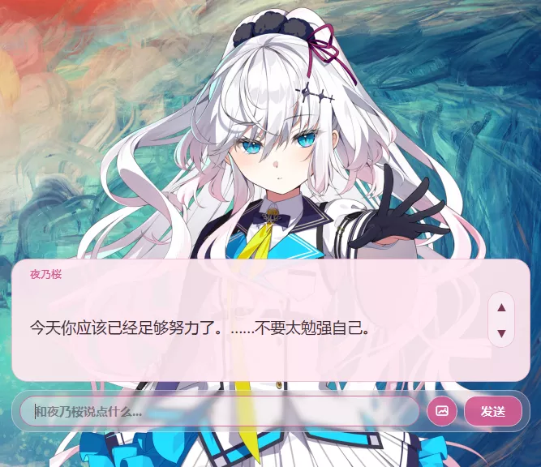
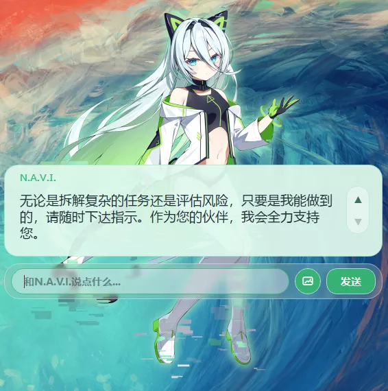

# Sakura Desktop Pet

### 一个能主动感知屏幕内容与系统事件的通用桌宠 Agent 框架

[English](docs/README.en.md)

最近推完水晶社的新作，~~推完自动变成学姐的狗~~，已经变成学姐的形状了，夜里辗转反侧怎么都睡不着。便以学姐的名字 **Sakura** 命名这个项目，开发了这个桌宠 Agent 框架。

Sakura 最大的特点是：**她会主动来找你**。

传统聊天机器人是一扇门，你不敲，它永远不会开。Sakura 更像一个窝在你屏幕角落的人——你不用一直陪她说话，但她会看你在做什么。觉得该开口了，就自己凑过来。

比如你在打游戏，死了好几回。她瞥一眼屏幕，小声说：「已经第三次了喔……要不我帮你查查攻略？」你一点头，她就真的打开浏览器搜一圈，还把重点贴进备忘录。

再比如你在看着其他角色的图，她发现后会立刻吃醋：「又在看别人啦？」然后软磨硬泡让你多看几眼她的立绘。你要是冷落她太久，她还会鼓着脸生气：「都不理我了啊……」

这一切的背后，是**角色卡**驱动她的对话风格、表情和语音，而**内置的 Agent 引擎**给了她真正的工具能力：浏览器操作、屏幕截图、文件读取、Web 搜索、提醒、长期记忆……

简单说：**一个完全由你定制的、会吃醋会操心会主动找你的桌面角色 Agent。**

## 效果预览

## 快速开始

推荐直接使用 **Release 里的最新版本**，不要只下载 GitHub 页面上的源码压缩包。

> **平台提醒：** Windows 版本是当前主要测试目标。Mac 和 Linux 用户请先看 [完整安装指南](docs/SETUP.md)。

1. 从 [Releases 页面](https://github.com/Rvosy/sakura/releases) 下载最新 `sakura-v0.9.x-windows-x64.zip`
2. 解压后双击 `install.bat` 安装依赖
4. 双击 `start.bat` 启动

遇到问题、使用 Mac/Linux、或想了解更多配置项，请看 **[完整安装指南](docs/SETUP.md)**。

## 功能特性

**角色与外观**
- 角色包驱动 — `.char` 一键导入，角色卡、立绘、GPT-SoVITS 语音权重一体打包；UI 主题色跟随角色
- 外观效果 — 支持纯色 / 高斯模糊 / 亚克力 / macOS 原生毛玻璃（NSVisualEffectView），气泡与输入栏位置、大小可调

**主动感知**
- 屏幕观察 — 定期截图生成视觉摘要并纳入上下文，也可随时按需截图；间隔与冷却时间可配置
- 主动发言 — 周期性评估是否需要开口，不用你先说话她就会自己凑过来

**对话体验**

- 分段双语回复 — 模型输出日文原文 + 中文字幕 + 语气标签 + 立绘指令，字幕、表情、语音同步驱动
- 打字机动效 — 逐字渲染，气泡高度随长回复自适应扩展，不截断
- 输入框动效 — 胶囊形高斯模糊背景，发送等待期间有状态提示

**工具能力**
- 内置工具 — 屏幕截图、打开网页、待办、提醒（支持「3 分钟后」等相对时间）、笔记读写
- 长期记忆 — 候选区 → 用户确认 → 正式写入，支持自动整理；本地向量模型离线运行
- 权限确认 — 高风险工具（打开网页、文件操作等）执行前弹出确认面板

**语音（TTS）**
- GPT-SoVITS 集成 — 一键下载整合包（RTX 50 系 / 通用 N 卡 / CPU 三档），语气标签联动参考音频
- 外置服务 — 可接入自部署的 GPT-SoVITS 实例，macOS / AMD 用户同样可用

**插件与扩展**
- MCP Server — 任意 MCP Server 均可接入，内置 Web 搜索 MCP
- 本地插件 — 插件自动发现与加载，Playwright 浏览器插件开箱可用

**调试与历史**
- GUI 运行日志 — 实时查看 Agent 决策与工具调用过程
- 聊天历史 — 可浏览和搜索历史对话

## 文档

| 文档 | 内容 |
|---|---|
| [安装与配置指南](docs/SETUP.md) | 完整安装步骤、API Key 配置、角色包获取、版本更新 |
| [macOS 安装指南](docs/MACOS_SETUP.md) | Apple Silicon/Rosetta、SSL 证书、GPT-SoVITS 语音 |
| [技术讲解 README](docs/TECHNICAL_README.md) | 运行时架构、启动流程、项目结构、配置项 |
| [插件 SDK 文档](docs/SAKURA_PLUGIN_SDK.md) | 插件开发入口 |

## 致谢与开源许可说明

Sakura Desktop Pet 受桌面 Agent、桌宠交互与插件化生态中多个开源项目启发。特别感谢 [Shinsekai](https://github.com/RachelForster/Shinsekai) 项目及其插件生态在桌宠、角色交互、插件扩展等方向上的探索，为 Sakura 的兼容设计和功能演进提供了参考。

本项目采用 MIT License 开源。你可以自由使用、复制、修改、合并、发布、分发、再授权或销售本项目代码，但需要保留本项目的版权声明和 MIT License 文本。

Copyright © 2026 Rvosy

### 第三方代码与兼容说明

本项目中的内置插件 `plugins/playwright_browser` 包含基于以下 MIT 开源项目的代码与改动：

- Project: [`shinsekai-playwright-browser`](https://github.com/RachelForster/shinsekai-playwright-browser)
- License: MIT License
- Copyright: Copyright © 2026 Chihiro

Sakura 在此基础上进行了适配和修改，用于提供 Playwright 浏览器自动化能力。

感谢所有开源项目作者和贡献者。

## Star History

<a href="https://www.star-history.com/?repos=Rvosy%2Fsakura&type=date&legend=top-left">
 <picture>
   <source media="(prefers-color-scheme: dark)" srcset="https://api.star-history.com/chart?repos=Rvosy/sakura&type=date&theme=dark&legend=top-left" />
   <source media="(prefers-color-scheme: light)" srcset="https://api.star-history.com/chart?repos=Rvosy/sakura&type=date&legend=top-left" />
   
 </picture>
</a>
