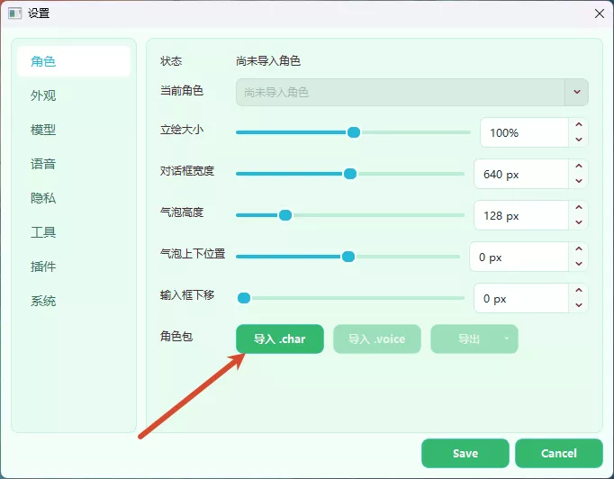

# Sakura 安装与配置指南

> 快速开始请看 [README.md](../README.md)；macOS 专项问题请看 [MACOS_SETUP.md](MACOS_SETUP.md)。

---

## 第一步：下载发布包

打开 [Releases 页面](https://github.com/Rvosy/sakura/releases)，下载最新的构建包。

| 文件名 | 是什么 | 适合谁下载 |
|:-:|---|---|
| `sakura-v0.9.x-windows-x64.zip` | Windows 完整包，包含项目文件和 `runtime` | **Windows 新手首选** |
| `runtime-windows-x64.zip` | 只有 Windows 预置 Python 运行环境 | 拉源码、缺 `runtime` 的用户 |
| `sakura.char` | 默认 Sakura 角色包（含语音权重） | 想使用默认角色的用户 |
| `models--sentence-transformers--all-MiniLM-L6-v2.zip` | 长期记忆所需的本地向量模型 | 首次启动自动下载失败时手动导入 |

> 如果你只是想运行桌宠，下载 `sakura-v0.9.x-windows-x64.zip` 这种**完整包**。`runtime` 包不是完整程序，单独下载后不能直接启动。

---

## 第二步：安装依赖

解压完整包后，进入解压出来的软件目录。

- **Windows 用户：** 双击 `install.bat`，等待完成（约 5-15 分钟）。
- **Mac 用户：** 可尝试双击 `install.command`，或在终端进入项目目录后运行 `bash scripts/install.sh`。从源码运行、依赖问题、Apple Silicon/Rosetta 架构问题以及 GPT-SoVITS 语音搭建，详见 **[MACOS_SETUP.md](MACOS_SETUP.md)**（已在 Apple Silicon 实机测试）。
- **Linux 用户：** 当前没有正式发布包；如果从源码运行，进入项目目录后运行 `bash scripts/install.sh`。

> 如果是直接拉取的源码，需要先从 Release 页面下载对应平台的预编译依赖包（`sakura-runtime-*.zip`），把里面的 `runtime` 文件夹放到项目根目录，再运行安装脚本。不管下载的是 Release 完整包还是 GitHub 源码，这一步都要做。装完命令行窗口会自动关闭。

---

## 第三步：启动

- **Windows 用户：** 双击 `start.bat`
- **Mac 用户：** 双击 `start.command`，或在终端运行 `bash scripts/start.sh`
- **Linux 用户：** 在终端运行 `bash scripts/start.sh`

首次启动会进入引导配置流程，按下面几步完成即可。

---

## 首次配置

### 导入角色包

从 [Releases 页面](https://github.com/Rvosy/sakura/releases) 下载角色包。Release 附件中，大小约 300MB、以 `.char` 结尾的文件即为包含语音的完整角色包。

下载后在软件设置中点击**导入 .char**，选择文件完成导入。

---

### 配置模型

进入**模型**页面，填写以下信息：

- **Base URL**：模型服务商提供的接口地址，通常以 `/v1` 结尾
- **API Key**：申请到的密钥，通常以 `sk-` 开头
- **模型**：填写服务商提供的模型名称，或点击**检测模型**自动获取可用列表

> **必须选择支持多模态（图像识别）的模型**，否则屏幕观察等功能会报错。推荐 Gemini Flash 系列。不要使用 DeepSeek 系列。

填写完成后点击**测试 API** 验证连通性。

---

### 配置语音（TTS）

TTS 为可选功能，不配置也可以正常使用，只是没有语音。

软件内提供了一键下载整合包的选项，根据你的设备选择：

| 方案 | 适合谁 |
|---|---|
| 50 系整合包 | RTX 50 系列显卡用户 |
| 通用整合包 | 其他 NVIDIA 显卡用户 |
| CPU 整合包 | 无独显或不支持 CUDA 的用户 |

下载完成后在软件内直接启动 TTS 服务即可。

#### AMD 显卡 / 外置 GPT-SoVITS

AMD 显卡用户如需 GPU 推理，可在 B 站搜索 GPT-SoVITS 整合包自行安装，然后在软件中选择**外置 GPT-SoVITS** 模式，按下图填写服务地址。

macOS 用户的 GPT-SoVITS 配置方式另见 [MACOS_SETUP.md](MACOS_SETUP.md)。

---

### 长期记忆模型

首次启动时，软件会在后台自动下载长期记忆所需的本地向量模型。下载过程中可以正常使用，无需等待。

如果遇到网络问题导致下载失败，可以从 [Releases 页面](https://github.com/Rvosy/sakura/releases) 手动下载 `models--sentence-transformers--all-MiniLM-L6-v2.zip`，然后在软件内导入。

---

## 如何更新版本

1. 关闭正在运行的 Sakura。
2. 从 [Releases 页面](https://github.com/Rvosy/sakura/releases) 下载同平台的最新完整包。
3. 解压后把新包里的文件复制到原 Sakura 目录，遇到同名文件选择**覆盖/替换**。
4. 如果启动失败，重新运行一次安装脚本（`install.bat` 或 `bash scripts/install.sh`）。
5. 正常启动即可，配置和角色数据会保留。
