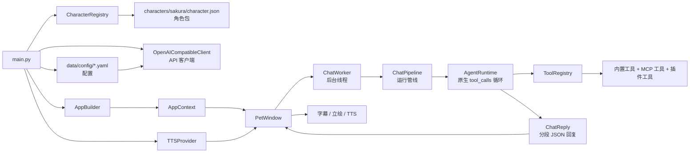

# Sakura 技术讲解 README

本文面向想深入了解 Sakura 架构、运行链路、配置方式或二次开发的用户。只想安装和使用桌宠的话，看 [主 README](../README.md) 就够啦。

## 设计思路

Sakura 采用比较直接的运行时结构：UI 负责收集用户输入、截图、确认面板和主动事件，`ChatWorker` / `ChatPipeline` 负责把这些上下文整理成一次运行请求，真正的对话决策和工具循环交给 `AgentRuntime`。

`AgentRuntime` 直接使用 OpenAI 兼容接口的原生 `tool_calls` 协议。模型可以在同一轮对话里决定是否调用工具，工具结果会以 tool role 回填给模型，再由模型产出最终角色回复。这样不再需要额外的路由拆分模块，链路更短，也更容易保证提醒、主动关怀、工具确认后的回复都进入同一套字幕和语音播放流程。

最终回复统一按分段 JSON 组织：每段包含日文原文、中文字幕、语气和立绘标识。UI 只消费这份结构，同步驱动字幕、表情切换和 TTS 播放；如果模型输出格式不合格，运行时会尝试一次格式修复，避免坏 JSON 直接进入界面。

## 启动流程

运行 `python main.py` 后：

1. 创建 `QApplication`
2. `AppSettingsService` 从 `data/config/api.yaml` 加载 API 配置
3. `CharacterRegistry` 扫描角色包
4. 加载角色人格卡和可用语气/立绘
5. `AppBuilder` 组装 `AppContext`，包括工具注册表、记忆库、提醒库、MCP、插件、TTS
6. 后台线程装配耗时服务（MCP 工具、插件、TTS Provider）
7. 显示 `PetWindow`



## 项目结构

```text
.
├── main.py                             # 应用入口
├── app/
│   ├── agent/                          # Agent 决策层
│   │   ├── actions.py                  # 动作/事件/待确认数据结构
│   │   ├── builtin_tools.py            # 内置工具（待办/提醒/笔记/记忆等）
│   │   ├── memory.py / reminders.py    # 长期记忆 / 提醒
│   │   ├── memory_curator.py           # 自动记忆整理（含后台 Worker）
│   │   ├── memory_curation_worker.py   # 自动记忆整理 Qt Worker
│   │   ├── runtime.py                  # AgentRuntime（决策/工具循环）
│   │   ├── runtime_limits.py           # 运行时限制常量
│   │   ├── screen_policy.py            # 屏幕观察策略
│   │   ├── screen_tools.py             # 屏幕观察工具
│   │   ├── screen_observation.py       # 屏幕观察入口
│   │   ├── proactive_care.py           # 主动关怀
│   │   ├── tool_policy.py              # 工具路由策略
│   │   ├── tool_registry.py            # 兼容层（→ app/agent/tools/）
│   │   ├── tools/                      # 统一工具注册系统
│   │   │   ├── registry.py             # ToolRegistry / Tool / ToolMetadata
│   │   │   ├── permission_policy.py    # ToolPermissionPolicy
│   │   │   └── builtin/provider.py     # BuiltinToolProvider
│   │   └── mcp/                        # MCP 工具（桥接/配置/Provider）
│   ├── core/                           # 应用核心
│   │   ├── app_context.py              # AppContext 依赖容器
│   │   ├── bootstrap.py                # 启动装配
│   │   ├── builder/                    # AppBuilder / ServiceContainer / Lifecycle
│   │   ├── contracts/                  # 核心接口契约
│   │   ├── chat_pipeline.py            # ChatPipeline 对话编排
│   │   ├── chat_worker.py              # Qt 后台线程 Worker
│   │   ├── debug_log.py                # 调试日志（自动脱敏）
│   │   ├── extensions.py               # 扩展注册表
│   │   ├── plugin_manager.py           # SakuraPluginManager（兼容层 → app/plugins/）
│   │   └── runtime/                    # 运行时编排
│   ├── config/                         # 配置管理
│   │   ├── models.py                   # 配置数据模型
│   │   ├── defaults.py                 # 默认值
│   │   ├── settings_service.py         # YAML 配置读写
│   │   ├── migrations.py               # .env → YAML 迁移
│   │   ├── character_loader.py         # 角色包加载
│   │   └── yaml_config.py              # YAML 通用工具
│   ├── llm/                            # LLM 客户端
│   │   ├── api_client.py               # OpenAI 兼容客户端
│   │   ├── chat_reply.py               # 分段回复解析
│   │   ├── context_trimming.py         # 上下文修剪
│   │   ├── prompt_templates.py         # 提示词模板
│   │   └── prompts/                    # 提示词块/渲染
│   ├── plugins/                        # 插件系统（原生）
│   │   ├── models.py                   # PluginManifest / PluginSpec / Contribution
│   │   ├── discovery.py                # PluginDiscovery
│   │   ├── capabilities.py             # PluginCapabilityRegistry
│   │   ├── manager.py                  # PluginManager
│   │   └── adapters.py                 # SDK 兼容适配
│   ├── storage/                        # 存储层
│   │   ├── paths.py                    # StoragePaths 统一路径
│   │   ├── chat_history.py             # 聊天历史（JSONL）
│   │   └── visual_observation.py       # 视觉观察记录（JSONL）
│   ├── ui/                             # UI 组件
│   │   ├── pet_window.py               # 桌宠主窗口
│   │   ├── settings_dialog.py          # 设置对话框
│   │   ├── history_window.py           # 历史回看
│   │   ├── portrait_controller.py      # 立绘控制器
│   │   ├── subtitle_controller.py      # 字幕控制器
│   │   ├── tool_confirmation_panel.py  # 工具确认面板
│   │   ├── portrait_utils.py           # 立绘工具函数
│   │   └── ...（其余 UI 组件）
│   └── voice/                          # 语音
│       ├── tts.py                      # GPT-SoVITS / Null Provider
│       └── playback_controller.py      # 语音播放控制器
├── sdk/                                # Shinsekai 兼容层（已废弃，新插件用 app/plugins/）
│   ├── plugin.py                       # PluginBase
│   ├── register.py                     # PluginCapabilityRegistry
│   ├── types.py                        # 贡献点类型
│   └── tool_registry.py                # 已废弃工具装饰器
├── plugins/                            # 本地插件
│   └── playwright_browser/             # Playwright 浏览器插件
├── characters/sakura/                  # 角色资源
├── data/                               # 本地数据
│   ├── config/                         # YAML 配置（api.yaml / system_config.yaml 等）
│   ├── chat_history/                   # 聊天记录
│   ├── memory/                         # 长期记忆
│   └── visual_observations/            # 视觉观察记录
├── tests/                              # pytest 测试
│   ├── unit/                           # 单元测试（配置 / LLM / 工具 / 运行时等）
│   ├── integration/                    # 集成测试（AgentRuntime / ChatPipeline 等）
│   └── ui/                             # UI 测试
├── docs/                               # 文档
│   ├── TECHNICAL_README.md             # 技术讲解 README
│   └── SAKURA_PLUGIN_SDK.md            # 插件开发指南
└── tools/mcp/                          # MCP Server 运行时
```

## 运行与测试

项目在 Release 完整包（或从 Release 下载 `runtime-*.zip` 后解压到根目录）时，根目录会包含 `runtime/`，Windows 可用 `./runtime/python.exe` 运行；从源码开发时也可以使用任意 Python 3.10+ 虚拟环境。

启动应用：

```powershell
python main.py
```

运行全部测试：

```powershell
python -m pytest
```

运行单元测试：

```powershell
python -m pytest tests/unit
```

## 配置项

所有配置集中在 `data/config/` 下的 YAML 文件中。

| YAML 路径 | 作用 | 默认值 |
|---|---|---|
| `api.yaml: llm.base_url` | API 地址 | `https://api.openai.com/v1` |
| `api.yaml: llm.api_key` | API Key | 空 |
| `api.yaml: llm.model` | 模型名称 | `gpt-4.1-mini` |
| `api.yaml: llm.timeout_seconds` | 超时时间 | `60` |
| `api.yaml: tts.enabled` | 启用 TTS | `false` |
| `api.yaml: tts.gpt_sovits.api_url` | TTS 接口 | `http://127.0.0.1:9880/tts` |
| `api.yaml: tts.gpt_sovits.python_path` | 自定义 GPT-SoVITS Python | 空 |
| `api.yaml: tts.gpt_sovits.tts_config_path` | 自定义 GPT-SoVITS 推理配置 | 空 |
| `system_config.yaml: ui.subtitle_language` | 气泡语言 `ja`/`zh` | `ja` |
| `system_config.yaml: ui.portrait_scale_percent` | 立绘缩放 | `100` |
| `system_config.yaml: proactive_care.enabled` | 主动关怀 | `false` |
| `system_config.yaml: proactive_care.check_interval_minutes` | 检查间隔 | `20` |
| `system_config.yaml: proactive_care.cooldown_minutes` | 冷却时间 | `10` |
| `system_config.yaml: memory_curation.enabled` | 自动记忆整理 | `true` |
| `system_config.yaml: mcp.windows_enabled` | Windows MCP | `false` |
| `system_config.yaml: debug.enabled` | 调试日志 | `false` |
| `characters.yaml: current_character_id` | 当前角色 | `sakura` |

## TTS 技术配置

语音默认关闭。需要自行启动兼容以下接口的本地 GPT-SoVITS API：

- `POST /tts`
- `GET /set_gpt_weights`
- `GET /set_sovits_weights`

在 `data/config/api.yaml` 或设置窗口中启用：

```yaml
tts:
  provider: gpt-sovits
  enabled: true
  gpt_sovits:
    api_url: http://127.0.0.1:9880/tts
    ref_lang: ja
    text_lang: ja
    timeout_seconds: 60
```

Windows 用户可以在设置窗口的 TTS 页点击“一键下载 TTS 整合包”安装当前内置的 Windows 整合包。macOS 用户会看到“GPT-SoVITS macOS 源码安装包”，点击后会在 `data/tts_bundles/installed/gpt_sovits_macos/` 下自动安装 Miniforge、创建 Python 3.10 环境、拉取 GPT-SoVITS 源码并生成 macOS 可用的推理配置。

脚本会下载固定版本的 Miniforge 并校验 SHA256；GPT-SoVITS 官方安装脚本默认按 MPS 依赖安装，推理配置默认使用 CPU 与关闭半精度以保持兼容，可通过 `GPT_SOVITS_INSTALL_DEVICE` 和 `GPT_SOVITS_INFER_DEVICE` 覆盖。这个 macOS 安装项只负责 GPT-SoVITS 源码、Python 环境和官方预训练基础模型；Sakura 等角色声线权重仍来自角色包的 `voice/models/`，由 `character.json` 读取后在启动 TTS 时切换。

下载窗口会按当前系统过滤整合包；Windows 不会展示 macOS 安装项，macOS 也不会展示只包含 Windows 运行时的整合包。

设置页新增的 `TTS Python` 和 `推理配置` 字段只用于自定义或 macOS 源码版 GPT-SoVITS；Windows 内置整合包无需填写。

如果已经在 macOS / Linux 上自行安装了 GPT-SoVITS 源码版，也可以在设置窗口把 TTS 提供器切到“自定义 GPT-SoVITS（macOS/Linux）”，并配置本地源码目录、Python 解释器和可选推理配置：

```yaml
tts:
  provider: custom-gpt-sovits
  enabled: true
  gpt_sovits:
    api_url: http://127.0.0.1:9880/tts
    work_dir: /path/to/GPT-SoVITS
    python_path: /path/to/miniforge3/envs/gpt-sovits/bin/python
    tts_config_path: /path/to/GPT-SoVITS/GPT_SoVITS/configs/tts_infer.yaml
    ref_lang: ja
    text_lang: ja
```

自定义 GPT-SoVITS 启动时会使用配置的 `python_path` 运行工作目录下的 `api_v2.py`；如果配置了 `tts_config_path`，会追加 `-c` 参数，并根据 `api_url` 追加监听地址和端口。

macOS 一键安装完成后会自动回填这些字段。内置整合包如果只包含其他平台的运行时，Sakura 会提示运行时不兼容，而不会直接执行到系统级 `Exec format error`。

## 插件开发

插件相关代码位于 `plugins/`、`app/plugins/` 和 `sdk/`。插件开发说明请看 [Sakura 插件 SDK 文档](SAKURA_PLUGIN_SDK.md)。
